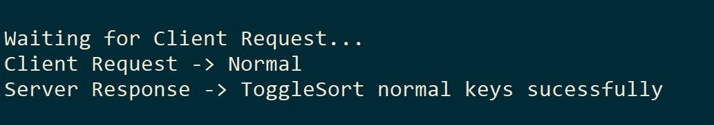

# keyboard-game

# Keyboard game is a funny console application that builds keyboard based on user input.:

## There are 3 Key categories 

* Normal (English alphabet).

* Special (Ctrl Alt and Shift).

* Functional (F1, F2…).

# Prerequisites 🔨

1. Install Windows 10, Linux or Mac
2. Install .Net Core version 5.0.202 https://dotnet.microsoft.com/download

## Deploy🚀

## Deploy Server

1. configure .env for Server: ```KeyboardGame\KeyboardGameServer\.env```

2. Build ```dotnet build```

3. Execute ```dotnet run```

## Deploy Client

1. configure .env for client: ```KeyboardGame\KeyboardGameConsole\.env```

2. Build ```dotnet build```

3. execute some commands

```
dotnet run b b a c e d ctrl shift alt f5 f2 f1 f2
```

## Structure 

<p align="center">
  
</p>

## Screenshots Server

### Init Server

<p align="center">
  
</p>

### Build Request

<p align="center">
  
</p>

### Keys Request

<p align="center">
  
</p>

### Combined Request

<p align="center">
  
</p>

### Test Request

<p align="center">
  
</p>

### Toggle Sort Request

<p align="center">
  
</p>

## Screenshots Client

### Menu

<p align="center">
  
</p>

### Show Keyboard

<p align="center">
  
</p>

### Show Details

<p align="center">
  
</p>

### Change Position

<p align="center">
  
</p>

### Combined Key

<p align="center">
  
</p>

### Toggle Sort

<p align="center">
  
</p>
