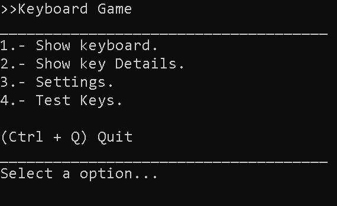
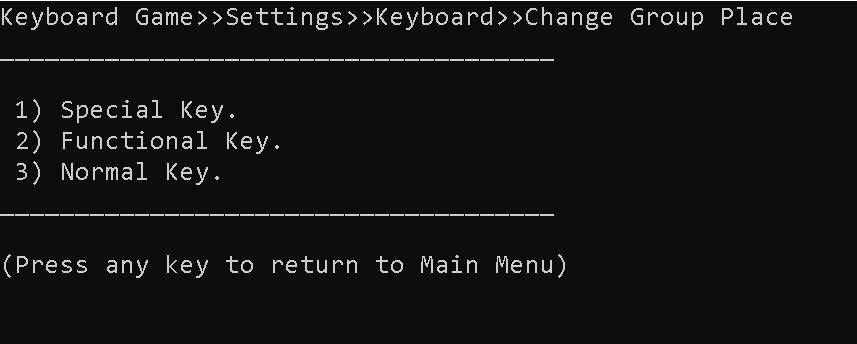
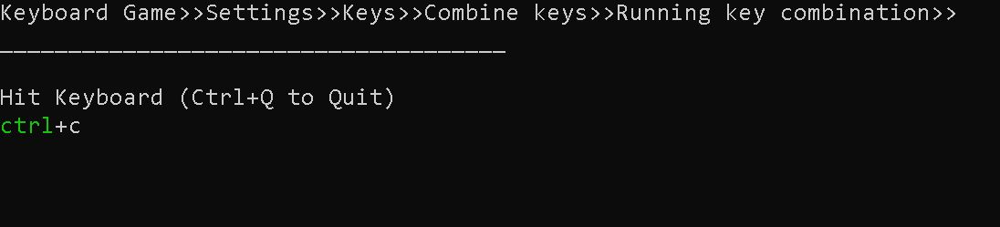
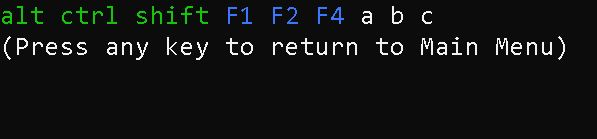
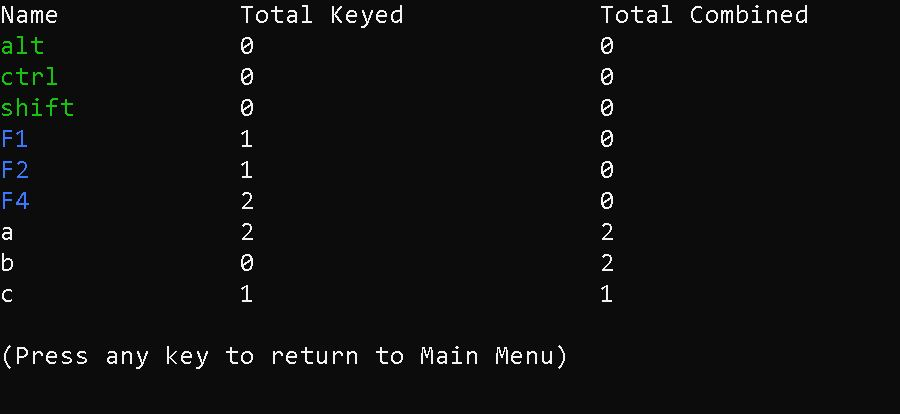

# keyboard-game🚀

# Keyboard game is a funny console application that builds keyboard based on user input.:

## There are 3 Key categories 

1. Normal (English alphabet).

2. Special (Ctrl Alt and Shift).

3. Functional (F1, F2…).

## Deploy🚀

### Enter to project and enter to folder "keyboard-game-console" and execute some commands:

For example

```
dotnet run ctrl ctrl B b a C C c A f2 f1 F4 shift shift shift alt alt
```

## Documentation

### Menu

<p align="center">
  
</p>

### Change Places

<p align="center">
  
</p>

### Running Combination

<p align="center">
  
</p>

### Show Keyboard

<p align="center">
  
</p>

### Show Keys Detail

<p align="center">
  
</p>
