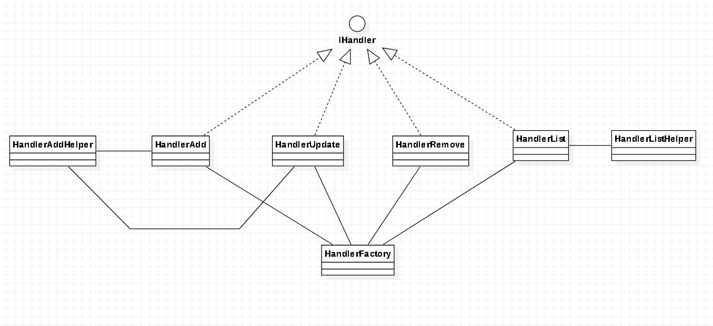
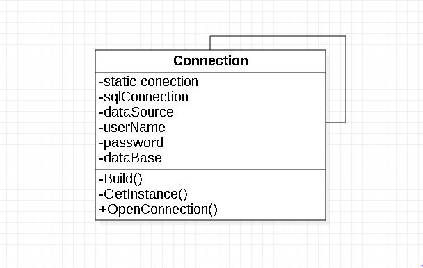
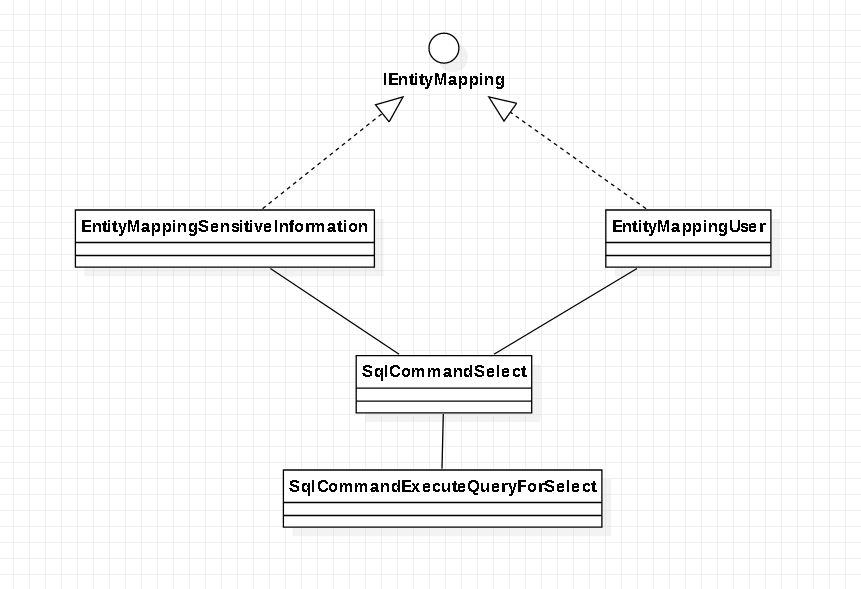
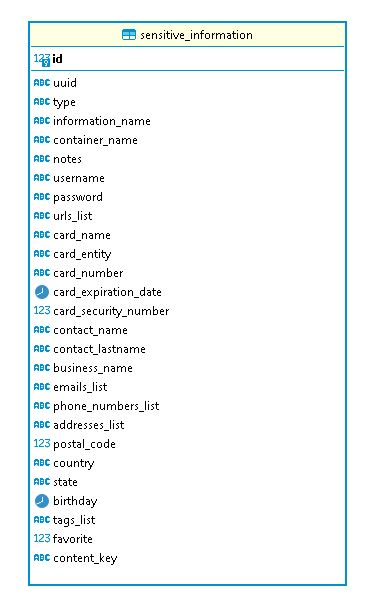
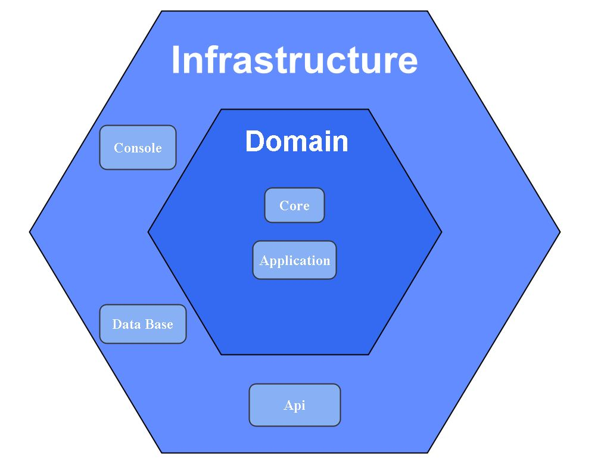
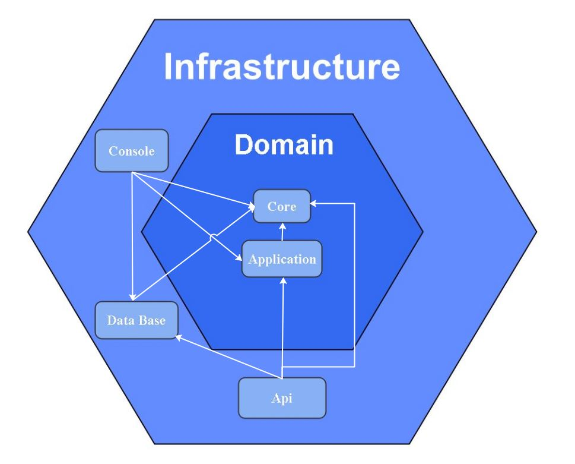

# Csharp
# Sensitive Information

A command line application that helps to manage sensitive information.

The app should add, update, remove, list the next sensitive information.

* Confidential notes
* Credential
* Keys
* Credit Cards
* Contacts

# Prerequisites 🔨

1. Install Windows 10, Linux or Mac
2. Install .Net Core version 5.0.202 ```https://dotnet.microsoft.com/download```

# Installation 🔧

### Installation SQL Server in docker.

0. Docker 20.10.5

1. download docker Sql Server image: 

```
docker pull mcr.microsoft.com/mssql server:2019-CU9-ubuntu-16.04
```

2. start container:

```
docker run -d --name sqlserver -e SA_PASSWORD=Secret-123 -e ACCEPT_EULA=Y -p 1433:1433  mcr.microsoft.com/mssql/server:2019-CU9-ubuntu-16.04
```
3. Sql Credentials

```
host: localhost
user: sa
password: Secret-123
port: 1433
database/schema: master
```

# Deploy 🚀

### Deploy Docker

0. execute all queries from sql folder: SensitiveInformation\SensitiveInformationDatabase\Sql

1. configure .env: ```SensitiveInformation\SensitiveInformationConsole\.env```

2. execute ```dotnet build```

# Diagrams 🎨

## Class Diagram

### Factory Pattern

<p align="center">
  
</p>

### Singleton Pattern

<p align="center">
  
</p>

### Strategy Pattern

<p align="center">
  
</p>

## Data Base

<p align="center">
  
</p>

## Architecture

<p align="center">
  
</p>

## Descriptive Architecture

<p align="center">
  
</p>

# Usage 🎮

## CONSOLE:

### Type of sensitive information
```
* Confidential notes:   note
* Credential:           credential
* Keys:                 key
* Credit Cards:         creditcard
* Contacts:             contact
```

### Entry Commands
```
* add
* remove
* update
* list
```

### Options Commands (Add, List, Update)
```
* -type
* -namenote
* -container
* -notes
* -username
* -password
* -cardname
* -cardentity
* -cardnumber
* -cardexpdate
* -cardsecuritynumber
* -contactname
* -contactlastname
* -bussinesname
* -postalcode
* -country
* -state
* -birthday
* -favorite
* -contentkey
* -urlslist
* -tagslist
* -emailslist
* -phoneslist
* -addresseslist
```

### Commands to Remove and Update
```
* -uuid
* -id
```

## Add Command
* If it is added without command options, it is added with default values.

### Add with all option commands.

```
bin\Debug\net5.0\App.exe add -type note -namenote "notes saved" -container folder -notes "save world" -username micky -password secret -cardname visa -cardentity visa -cardnumber 4552-456-874-1235 -cardexpdate 2021-10-10 -cardsecuritynumber 1054 -contactname "miguel rodrigo" -contactlastname "aguilar paredes" -bussinesname cafe -postalcode 4568 -country bolivia -state cochabamba -birthday 1994-10-10 -favorite -contentkey windows -urlslist facebookcom,twitercom -tagslist @tag1,@tag2 -emailslist miguel@gmail.com -phoneslist 78451235,61487954 -addresseslist av-galindo,av-sacaba,av-petrolera
```

### Add with one option command or more
``bin\Debug\net5.0\App.exe add -type note``

```
bin\Debug\net5.0\App.exe add -type creditcard -cardname "visa debit" -cardentity visa -cardnumber 7842-125-236-89541 -cardexpdate 2022-09-28 -cardsecuritynumber 4825
```

```
bin\Debug\net5.0\App.exe add -type contact -namenote "contacts saved" -contactname "miguel rodrigo" -contactlastname "aguilar paredes" -favorite
```

### Add in desorder
* ``bin\Debug\net5.0\App.exe add -favorite -contactname "romel" -type contact``

### Add only in Lists
* ``bin\Debug\net5.0\App.exe add -tagslist @tag1,@tag2,@tag3,@tag4``

* ``bin\Debug\net5.0\App.exe add -tagslist @tag1,@tag2 -emailslist miguel@gmail.com,micky@hotmail.com -phoneslist 78452135,64785621``

## List Command

### List all data.
* ``bin\Debug\net5.0\App.exe list``

### List filter with all option commands.
* ``bin\Debug\net5.0\App.exe list -type contact``
* ``bin\Debug\net5.0\App.exe list -country bolivia``
* ``bin\Debug\net5.0\App.exe list -state cochabamba``
* ``bin\Debug\net5.0\App.exe list -favorite``
* ``bin\Debug\net5.0\App.exe list -bussinesname cafe``

### List filter with element in array
* ``bin\Debug\net5.0\App.exe list -tagslist @tag2``
* ``bin\Debug\net5.0\App.exe list -phoneslist 78452135``
* ``bin\Debug\net5.0\App.exe list -addressesList av-galindo``

```
{
  "id": 1,
  "uuid": "036fa660-1c82-4f0d-8b19-db9337119ba0",
  "type": note,
  "informationName": "notes saved",
  "containerName": "folder",
  "notes": "save world",
  "username": "micky",
  "password": "secret",
  "cardName": "visa",
  "cardEntity": "visa",
  "cardNumber": "4552-456-874-1235",
  "cardExpirationDate": "2021-10-10T00:00:00",
  "cardSecurityNumber": 1054,
  "contactName": "miguel rodrigo",
  "contactLastname": "aguilar paredes",
  "businessName": "cafe",
  "postalCode": 4568,
  "country": "bolivia",
  "state": "cochabamba",
  "birthday": "1994-10-10T00:00:00",
  "favorite": true,
  "contentKey": "windows",
  "urlsList": [
    "facebookcom",
    "twitercom"
  ],
  "tagsList": [
    "@tag1",
    "@tag2"
  ],
  "emailsList": [
    "miguelgmail.com"
  ],
  "phoneNumbersList": [
    "78451235",
    "61487954"
  ],
  "addressesList": [
    "av-galindo",
    "av-sacaba",
    "av-petrolera"
  ]
}
```

## Update Command

### UUID
* ``bin\Debug\net5.0\App.exe update -uuid xxxxxxx-xxxx-xxxx-xxxx-xxxxxxxxxxxx -type contact``

### ID
* ``bin\Debug\net5.0\App.exe update -id 1 -type credential``

### Update (UUID, ID)

### Update more than one value
```
bin\Debug\net5.0\App.exe update -id 1 -contactname "jose luis" -contactlastname "candia perez" -country mexico -state guadalajara
```

```
bin\Debug\net5.0\App.exe update -uuid xxxxxxxx-xxxx-xxxxx-xxxx-xxxxxxxxx -contactname "walter" -contactlastname "white" -country usa -state "new york" -container folder -username w-withe -password withe
```

## Remove Command

### UUID
* ``bin\Debug\net5.0\App.exe remove -uuid xxxxxxxx-xxxx-xxxxx-xxxx-xxxxxxxxx``

### ID
* ``bin\Debug\net5.0\App.exe remove -id 1``

## API:

```
GET localhost:5000/sensitiveinformation
POST localhost:5000/sensitiveinformation
POST localhost:5000/sensitiveinformationfilter
PUT localhost:5000/sensitiveinformation/1
DELETE localhost:5000/sensitiveinformation/1

{
  "id": 1,
  "uuid": "xxxxxxxx-xxxx-xxxx-xxxx-xxxxxxxxxxxx",
  "type": "note",
  "informationName": "sensitive notes",
  "containerName": "notes",
  "notes": "notes of passwords",
  "username": "romeo",
  "password": "medrano",
  "cardName": "card",
  "cardEntity": "visa debit",
  "cardNumber": "6544-0223-0007-5042",
  "cardExpirationDate": "2022-12-15T00:00:00",
  "cardSecurityNumber": 3371,
  "contactName": "romeo",
  "contactLastname": "garcia medrano",
  "businessName": "pool room",
  "postalCode": 5551,
  "country": "BOLIVIA",
  "state": "santa cruz",
  "birthday": "1884-10-10T00:00:00",
  "favorite": true,
  "contentKey": "linux",
  "urlsList": [
    "tiktok.com",
    "facebook.com",
    "twiter.com",
    "whatsapp.com"
  ],
  "tagsList": [
    "@note1",
    "@note2",
    "@note3"
  ],
  "emailsList": [
    "romeo@gmail.com",
    "garc@hotmail.com"
  ],
  "phoneNumbersList": [
    "71765481"
  ],
  "addressesList": [
    "4toanillo",
    "2 anillo"
  ]
},
```
